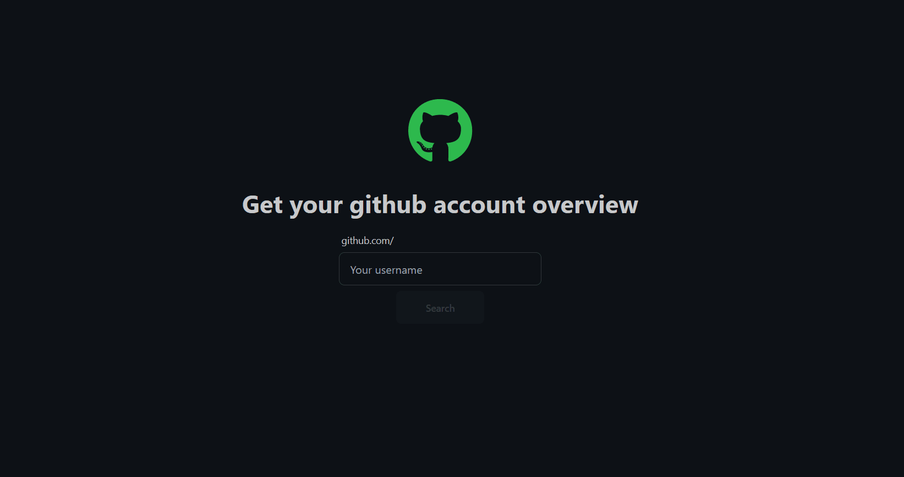

# Github Account Overview

Aplicação construída com angular que se integra perfeitamente com a API do GitHub, fornecendo insights abrangentes sobre perfis de usuários e estatísticas de repositórios.

## Stack utilizada

**Front-end:** 
* **Angular** - Framework front-end projetada com Typescrypt
* **TailwindCSS** - Framework de estilos utilitários para desenvolvimento web que facilita a criação de interfaces com classes pré-definidas.
* **DaisyUI** - Biblioteca de componentes customizáveis baseada no TailwindCSS.

## Deploy
[https://github-account-overview.vercel.app/](https://github-account-overview.vercel.app//)

## Demonstração

## Links

